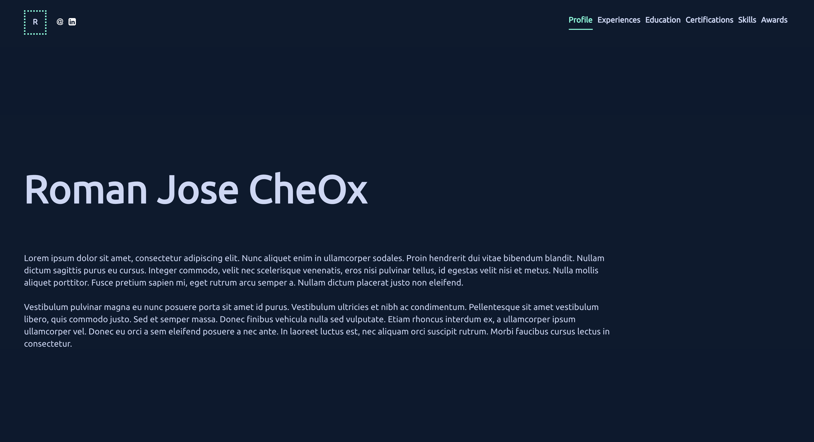

# :zap: Template Navy React

This template has been created for the use of the AMAZING [lightning-resume project](https://github.com/lightning-resume/lightning-resume)

##  How it works

The template reads the JSON generated by [linkedin-resume-parser](https://github.com/lightning-resume/linkedin-resume-parser).

## How it looks like

Check the [Demo](https://lightning-resume.github.io/template-navy-react/)

**Web:**

**Mobile:**

